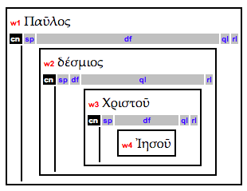
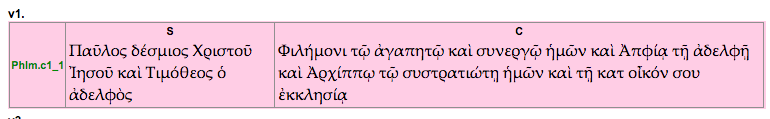

# OpenText.org Original Annotation


## Base level

* The base level XML contains:
	1. milestone elements for **chapter** and **verse** segments
	2. `<w>` word elements that contain:
		1. part-of-speech information `<pos>`
		2. word form information `<wf>` - **N.B.** for copyright reasons inflected forms are missing*
		3. semantic domain informaion `<sem>`

* Example segment of base XML:

```
<book name="Phlm">
  <chapter sID="NT.Phlm.1" num="1"/>
  <verse sID="NT.Phlm.1.1" num="1"/>
  <w xml:id="NT.Phlm.w1" ref="NT.Phlm.1.1">
    <pos>
      <NON num="sing" cas="nom" gen="mas"/>
    </pos>
    <wf betaLex="*pau=los" lex="Παῦλος"></wf>
    <sem>
      <domain majorNum="93" subNum="294"/>
    </sem>
  </w>
  <w xml:id="NT.Phlm.w2" ref="NT.Phlm.1.1">
    <pos>
      <NON num="sing" cas="nom" gen="mas"/>
    </pos>
    <wf betaLex="de/smios" lex="δέσμιος"></wf>
    <sem>
      <domain majorNum="37" subNum="117"/>
    </sem>
  </w>
  <w xml:id="NT.Phlm.w3" ref="NT.Phlm.1.1">
    <pos>
      <NON num="sing" cas="gen" gen="mas"/>
    </pos>
    <wf betaLex="*xristo/s" lex="Χριστός"></wf>
    <sem>
      <domain majorNum="93" subNum="387"/>
      <domain majorNum="53" subNum="82"/>
    </sem>
  </w>

  ....
```


### Word group annotation


* Example segment of word group XML:


```
<chapter xmlns:xlink="http://www.w3.org/1999/xlink" book="Phlm" num="1">
  <wg.groups>
    <wg.group xml:id="NT.Phlm.1_wg1">
      <wg.head>
        <wg.word xlink:href="NT.Phlm.w1">
          <wg.modifiers>
            <wg.definer>
              <wg.word xlink:href="NT.Phlm.w2">
                <wg.modifiers>
                  <wg.qualifier>
                    <wg.word xlink:href="NT.Phlm.w3">
                      <wg.modifiers>
                        <wg.definer>
                          <wg.word xlink:href="NT.Phlm.w4"/>
                        </wg.definer>
                      </wg.modifiers>
                    </wg.word>
                  </wg.qualifier>
                </wg.modifiers>
              </wg.word>
            </wg.definer>
          </wg.modifiers>
        </wg.word>
      </wg.head>
    </wg.group>

    ...
```

* This is the first word group in Philemon and is represented in the [word group box diagrams](http://opentext.org/texts/NT/Phlm/view/wordgroup-ch1.v0.html) like this:



### Clause level

* Example segment of word group XML:


```

<chapter xmlns:xlink="http://www.w3.org/1999/xlink" book="Phlm" num="1">
  <cl.clause xml:id="NT.Phlm.1_c1" level="primary" structure="S-C">
    <cl.S>
      <w xlink:href="NT.Phlm.w1"/>
      <w xlink:href="NT.Phlm.w2"/>
      <w xlink:href="NT.Phlm.w3"/>
      <w xlink:href="NT.Phlm.w4"/>
      <w xlink:href="NT.Phlm.w5"/>
      <w xlink:href="NT.Phlm.w6"/>
      <w xlink:href="NT.Phlm.w7"/>
      <w xlink:href="NT.Phlm.w8"/>
    </cl.S>
    <cl.C>
      <w xlink:href="NT.Phlm.w9"/>
      <w xlink:href="NT.Phlm.w10"/>
      <w xlink:href="NT.Phlm.w11"/>
      <w xlink:href="NT.Phlm.w12"/>
      <w xlink:href="NT.Phlm.w13"/>
      <w xlink:href="NT.Phlm.w14"/>
      <w xlink:href="NT.Phlm.w15"/>
      <w xlink:href="NT.Phlm.w16"/>
      <w xlink:href="NT.Phlm.w17"/>
      <w xlink:href="NT.Phlm.w18"/>
      <w xlink:href="NT.Phlm.w19"/>
      <w xlink:href="NT.Phlm.w20"/>
      <w xlink:href="NT.Phlm.w21"/>
      <w xlink:href="NT.Phlm.w22"/>
      <w xlink:href="NT.Phlm.w23"/>
      <w xlink:href="NT.Phlm.w24"/>
      <w xlink:href="NT.Phlm.w25"/>
      <w xlink:href="NT.Phlm.w26"/>
      <w xlink:href="NT.Phlm.w27"/>
      <w xlink:href="NT.Phlm.w28"/>
      <w xlink:href="NT.Phlm.w29"/>
    </cl.C>
  </cl.clause>

  ...

```


* This is the first clause in Philemon and is represented in the [clause box diagrams](http://opentext.org/texts/NT/Phlm/view/clause-ch1.v0.html) like this:




